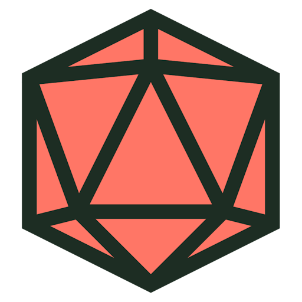

# impulse ([site](https://impulse.alexnoddings.com/))

impulse is a loose, simplified
[TTRPG](https://en.wikipedia.org/wiki/Tabletop_role-playing_game) framework
inspired by
[improv comedy](https://en.wikipedia.org/wiki/Improvisational_theatre)
and the principle of
["yes and"](https://en.wikipedia.org/wiki/Yes,_and...)
, where games play out like a movie that everyone is co-writing in real time.

Being designed for one-shot campaings, impulse games don't come with intricate, fleshed-out worlds.
They start with a setting, some characters, and an end goal in mind. It's up to everyone playing where it goes from there.

## Design requirements

impulse has the following design requirements:

- Be accessible for new TTRPG-ers
- Be engaging for veteran TTRPG-ers
- Have low friction and downtime

## Core principles

- **Simplicity** - the core mechanics are incredibly simple, and should be explainable in a few short minutes
- **Collaboration** - above all else, impulse should be a fun time with friends!
- **Maximise flow** - games should promote talking to characters, performing actions, interacting with the world
- **Minimise ceremony** - games should reduce explaining mechanics and rules, flipping through characters sheets, totting up dice rolls and modifiers

## License

Impulse is fully open-source and [MIT licensed](LICENSE).
